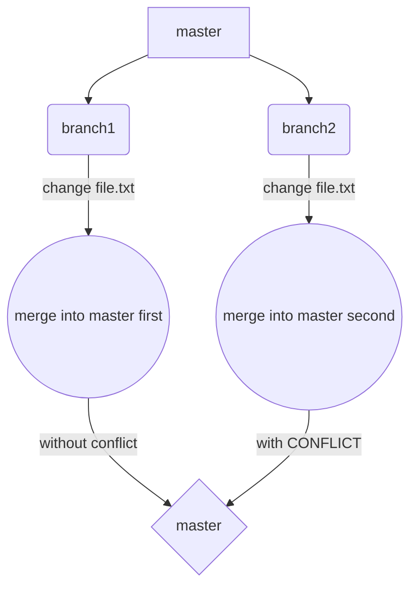
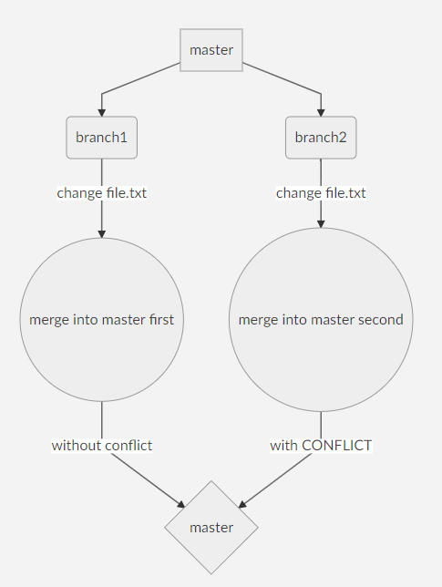
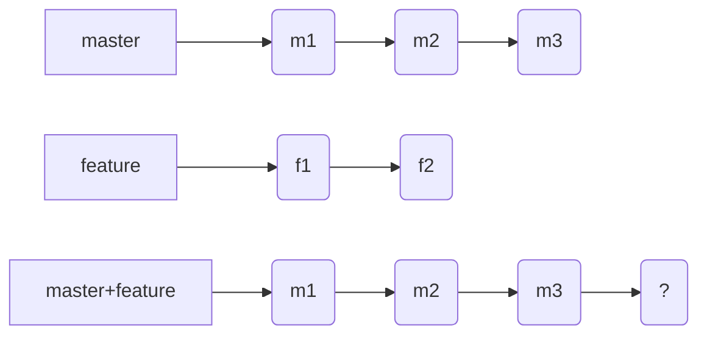
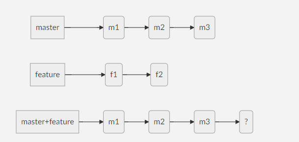
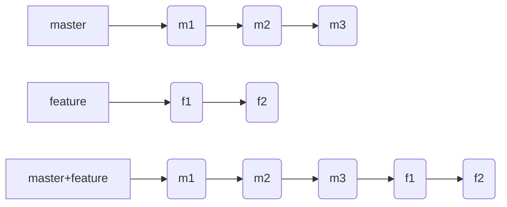
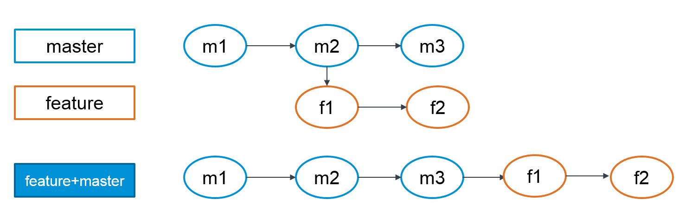

# GitSession

## What is Git?

Distributed Version Control System (DVCS)

These systems do not necessarily rely on a central server to store all the versions of a project file.

In Distributed VCS, every contributor has a local copy or “clone” of the main repository i.e. everyone maintains a local repository of their own which contains all the files and metadata present in the main repository.

[Reference](https://www.quora.com/What-is-Git-and-why-should-I-use-it)

### Diference between Working Tree, Local and Remote repository

- Working Tree: Where code changes are made

- Local Repository: Commit command happens

- Remote Repository: Push, Pull command happen

Git LOG explanation

### What Origin means?

**ORIGIN**  is an **alias**  *_on your system_* for a particular remote repository. It's not actually a property of that repository.

    [ ~/GitSession ]
    $ git remote -v      # show the name for the remote branch/repo
    origin  https://github.com/AifoSca/GitSession.git (fetch)
    origin  https://github.com/AifoSca/GitSession.git (push)

    ### How can you push in this situation
    $ git push origin master 
    or
    $ git push https://github.com/AifoSca/GitSession.git master

    ### Renaming the remote repository
    [ ~/GitSession ]
    $ git remote rename origin remote_repo    # to change the name
    [ ~/GitSession ]
    $ git remote -v
    remote_repo     https://github.com/AifoSca/GitSession.git (fetch)
    remote_repo     https://github.com/AifoSca/GitSession.git (push)
    
    ### How can you push in this situation
    $ git push remote_repo master
    or
    $ git push https://github.com/AifoSca/GitSession.git master

## Git Basic commands!!
| Git Command | 	Explanation											    |
| --------   |--------------------------------------------------------------|
| git help <command>| Similar to man                                        |
| git init   | 	 Initialize Local Git repository                            |
| git config  --global user.name 'your.name' | 	Adds name   |
| git config --global user.email 'your.email' |	Adds email |
| git add	 | Add Files to index |
| git status |	Check the status of Working Tree|
| git commit |	Commit Changes In Index (git commit --amend) |
| git push	 | Push to Remote repository  |
| git pull	 | Pull latest from remote repository |
| git clone	 | Clone repository into a new directory |
| git log    | lists commit log |
| git diff 	 | difference between |

### Let's do a small exercise 

 1. Clone this repo (if you haven't)
 2. Create a new LOCAL branch
 3. Make same changes in a new file!
 4. Commit Locally those changes! :)
 
### How do merge conflict happen?

A merge conflict occurs when there are 2 changes to the same part of the code.

Git can always directly merge a piece of code _if only one side of the merge changed it_ in this case when we merge branch1 into master we change the base for branch2 that why it only gave problems when we merged branch2.

## .gitignore?...and what about git stash?

**gitignore** file specifies intentionally untracked files that Git should ignore. Files already tracked by Git are not affected; see the NOTES below for details.
Each line in a gitignore file specifies a pattern. When deciding whether to ignore a path, Git normally checks gitignore patterns from multiple sources, with the following order of precedence, from highest to lowest.

**git stash** used when you want to record the current state of the working directory and the index, but want to **go back to a clean** working directory. The command saves your local modifications away and reverts the working directory to match the HEAD commit.

## Merge vs Rebase

Small exercise

please achieve this IN the **master** branch:

And Now this in the **feature** branch

## Revert and Reset

## Cherry-pick
